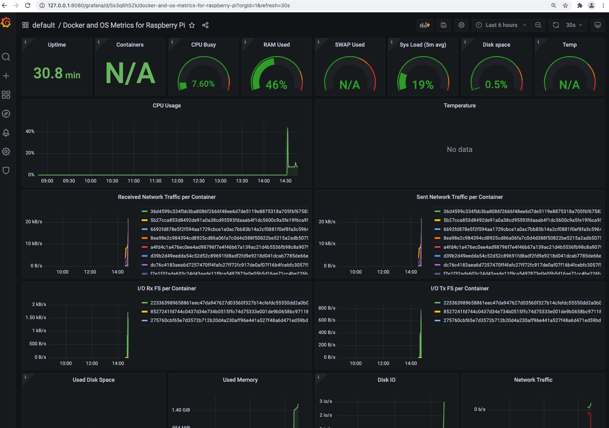

# Pre-Requisities

Be familiar with:
* Azure Cloud
* terraform
* kubernetes (k3s, kubectl, ingress, helm, helm charts, Grafana, Prometheus)
* Git

Required Software installed on candidates machine:
* az binary
* terraform binary
* ssh
* curl
* telnet
* git


Your task will be to deploy resources in Azure Cloud and provide access to deployed service.

Link to the Git repository will be provided to you.

# Assessment

Your task is to deploy a VM running on Azure using terraform.
Then you will install kubernetes on the VM (with k3s) and deploy Grafana/Prometheus using helm charts.

To successfully complete this assessment, you should be able to open up Grafana dashboard which we've prepared for you.

## Git

Clone git repo to your machine and create new branch named **assessmentX** where X will be replaced by number you'll get assigned.

```sh
TODO GITURL
```

**At the end, push your solution back to the remote repository.**

## Terraform Infrastructure

### Generate ssh keys
First, generate ssh private and public key, which should be used to access the VM.

### Create terraform code

Terraform code should deploy VM and enable access to HTTP and SSH via public IP address.

In the *terraform* directory, you'll find a skeleton for your infra code.

The code should be placed in **main<void>.tf** and **output<void>.tf**


`Hint` Use following image for the VM:
```sh
  os_disk {
    name                 = "myosdisk1"
    caching              = "ReadWrite"
    storage_account_type = "Standard_LRS"
  }

  source_image_reference {
    publisher = "Canonical"
    offer     = "0001-com-ubuntu-server-focal"
    sku       = "20_04-lts-gen2"
    version   = "latest"
  }
```

Following commands can be used to deploy the infra code:

```sh
# Service Principal settings
az login
export TF_VAR_admin_pass="Password12345"
# NOTE replace X with number you got assigned
export TF_VAR_prefix="assessmentX"

terraform init
terraform validate
terraform plan
terraform apply
```


## Kubernetes

### Install kubernetes

For the sake of simplicity we'll use **k3s** to spin-up a single node kubernetes cluster.

Following command will do the job:
```sh
curl -sfL https://get.k3s.io | sh -s - --write-kubeconfig-mode 644 --tls-san $(curl ifconfig.me)
export KUBECONFIG=/etc/rancher/k3s/k3s.yaml
```

### Install helm binary

We'll use helm charts to deploy Grafana and Prometheus, but first you need to download **helm** binary.
Refer to [Installing Helm](https://helm.sh/docs/intro/install) in the official documentation. Preffered installation method is **From Script**

After you've successfully downloaded and installed helm binary:
* add following helm repositories for Grafana and Prometheus ([Documentation](https://helm.sh/docs/helm))

```
grafana https://grafana.github.io/helm-charts
prometheus-community https://prometheus-community.github.io/helm-charts
```


### Deploy Grafana

Use following command to deploy Grafana helm chart:

```sh
helm upgrade --install grafana grafana/grafana \
--set ingress.enabled=true \
--set "ingress.hosts[0]=assessment" \
--set ingress.path=/grafana \
--set grafana\\.ini.server.root_url="%(protocol)s://%(domain)s/grafana" \
--set grafana\\.ini.server.serve_from_sub_path=true \
--set "datasources.datasources\\.yaml.datasources[0].name=PrometheusDSAssessment" \
--set "datasources.datasources\\.yaml.datasources[0].type=prometheus" \
--set "datasources.datasources\\.yaml.datasources[0].url=http://prometheus-server/prometheus" \
--set dashboards.default.monitoring.gnetId=15120 \
--set dashboards.default.monitoring.revision=3 \
--set dashboards.default.monitoring.datasource=PrometheusDSAssessment \
--set "dashboardProviders.dashboardproviders\\.yaml.providers[0].name=default" \
--set "dashboardProviders.dashboardproviders\\.yaml.providers[0].orgId=1" \
--set "dashboardProviders.dashboardproviders\\.yaml.providers[0].folder=default" \
--set "dashboardProviders.dashboardproviders\\.yaml.apiVersion=1" \
--set "dashboardProviders.dashboardproviders\\.yaml.providers[0].type=file" \
--set "dashboardProviders.dashboardproviders\\.yaml.providers[0].editable=true" \
--set "dashboardProviders.dashboardproviders\\.yaml.providers[0].disableDeletion=true" \
--set "dashboardProviders.dashboardproviders\\.yaml.providers[0].options.path=/var/lib/grafana/dashboards" \
--set persistence.enabled=true \
--set persistence.type=pvc \
--set persistence.size=1Gi \
--set persistence.storageClassName=local-path
```


### Deploy Prometheus

Use following command to deploy Prometheus helm chart:

```sh
helm upgrade --install prometheus prometheus-community/prometheus \
--set alertmanager.enabled=false \
--set kubeStateMetrics.enabled=false \
--set pushgateway.enabled=false \
--set nodeExporterenabled=false \
--set server.ingress.enabled=true \
--set "server.ingress.hosts[0]=assessment" \
--set server.ingress.path=/prometheus \
--set server.prefixURL=/prometheus \
--set "server.extraFlags[0]=web.external-url=/prometheus" \
--set server.persistentVolume.enabled=true \
--set server.persistentVolume.storageClass=local-path \
--set server.persistentVolume.size=2Gi
```

### Patching ingress

Ingress is host-based and the helm charts you've deployed require you to specify a hostname, in this case it was set to *assessment*.
```sh
# for Grafana
--set "ingress.hosts[0]=assessment" \

# for Prometheus
--set "server.ingress.hosts[0]=assessment" \
```

Try to access Grafana with curl without and with setting Host header in the request:

```sh
# this will return 404
curl -I http://<VM_IP_ADDRESS>/grafana
# this will return 200
curl -I http://<VM_IP_ADDRESS>/grafana -H "Host: assessment"
```

In order to access Grafana and Prometheus from any host, apply prepared patches in **patches** directory. Refer to official [kubernetes documentation](https://kubernetes.io/docs/tasks/manage-kubernetes-objects/update-api-object-kubectl-patch/) for more information on how to apply a patch.

## Login to Grafana

Default username is *admin* and initial password is randomly generated by helm chart.
To find out the password run:

```sh
helm get notes grafana
```

Now you should be able to login to Grafana and see one **default** dashboard.



## Bonus Tasks

### terraform custom_data script

By completing this bonus task, you should be able to just run `terraform apply` and after few minutes you should reach the grafana installation on your VM's IP address.

Create a script which will effectivelly do all the manual steps from previous tasks and add **custom_data** key to terraform code to be executed after the VM is created.

```sh
resource "azurerm_virtual_machine" "main" {
  ...

  custom_data = ...

  os_disk {
    name                 = "myosdisk1"
    caching              = "ReadWrite"
    storage_account_type = "Standard_LRS"
  }

  source_image_reference {
    publisher = "Canonical"
    offer     = "0001-com-ubuntu-server-focal"
    sku       = "20_04-lts-gen2"
    version   = "latest"
  }


}
```

### kubernetes ingress

* What ingress is used in your k3s installation?
* In which namespace is the ingress running?
* What other ingresses do you know?

### changing Grafana password

* Where is the password stored?
* What options are there to change/set Grafana's password?
